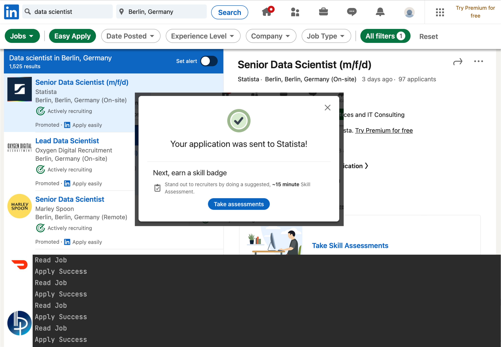
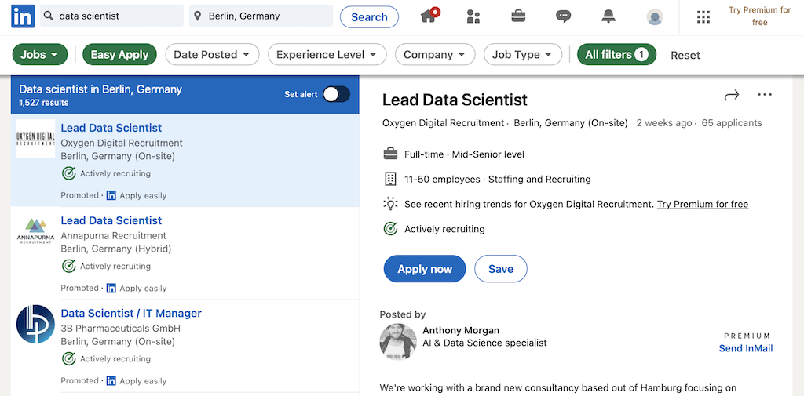

# Automated Job Application

<!-- TABLE OF CONTENTS -->

  
Table of Contents

  <ol>
    <li>
      <a href="#about-the-project">About the Project</a>
    </li>
    <li><a href="#features">Futures</a></li>
    <li><a href="#howto">How to set up</a></li>
    <li><a href="#usage">Usage</a></li>
    <li><a href="#license">License</a></li>
  </ol>

<!-- ABOUT THE PROJECT -->
## About the Project

Automatically log in, fill information, and apply for a job offer on LinkedIn with only a few lines of code on Python. 
That is the one line description of this project. I always wanted to have some kind of automated system to help fill
all the repetitive information of an online application. In fact, it is simpler than first expected with the help of
[`Selenium`](https://selenium-python.readthedocs.io) and [`ChromeDriver`](https://chromedriver.chromium.org/downloads).

**Repository:** [Automated Job Application](https://github.com/drliptons/automated-job-application)

(<a href="#top">back to top</a>)

<!-- FEATURES -->
## Features
___

* Automatically log in to LinkedIn
* Automatically fill LinkedIn information
* Automatically apply to a job

(<a href="#top">back to top</a>)

<!-- HOWTO -->
## How to set up
___

There are a few things that are required before to use this code. 

**Prerequisite**

* Google Chrome
* [Chrome Driver](https://chromedriver.chromium.org/downloads): Download a version of `ChromeDriver` that matches 
the Google Chrome Browser on the local machine
* LinkedIn account
* LinkedIn url

**Setup Code**

* **`ACCOUNT_EMAIL`:** LinkedIn username
* **`ACCOUNT_PASSWORD`:** LinkedIn password
* **`PHONE`:** phone number that can be contacted
* **`URL`:** LinkedIn search page (see example picture below)

* **`CHROME_DRIVER_PATH`:** path to ChromeDriver.

<!-- USAGE -->
## Usage
___
This project is for education and demonstration purposes. Anyone who is interested in this code is free to use it without any
prior permission.

(<a href="#top">back to top</a>)

<!-- LICENSE -->
## License
___
Distributed under the MIT License. Please see `LICENSE.md`
for further information

(<a href="#top">back to top</a>)
